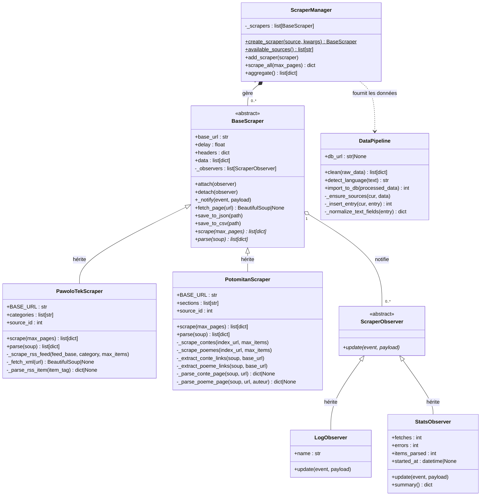

# Diagramme de classes — Phase 1 : Scraper Lang Matinitjé

> Rendu automatique sur GitHub. Export PNG : coller le bloc Mermaid sur [mermaid.live](https://mermaid.live)

## Légende des patterns

| Pattern | Classes impliquées |
|---|---|
| **Template Method** | `BaseScraper` définit le squelette ; `scrape()` et `parse()` sont abstraites |
| **Observer** | `BaseScraper` (sujet) → `ScraperObserver` (observateurs) |
| **Factory** | `ScraperManager.create_scraper()` instancie la bonne sous-classe |
| **Strategy** | Chaque scraper encapsule sa propre stratégie d'extraction |
